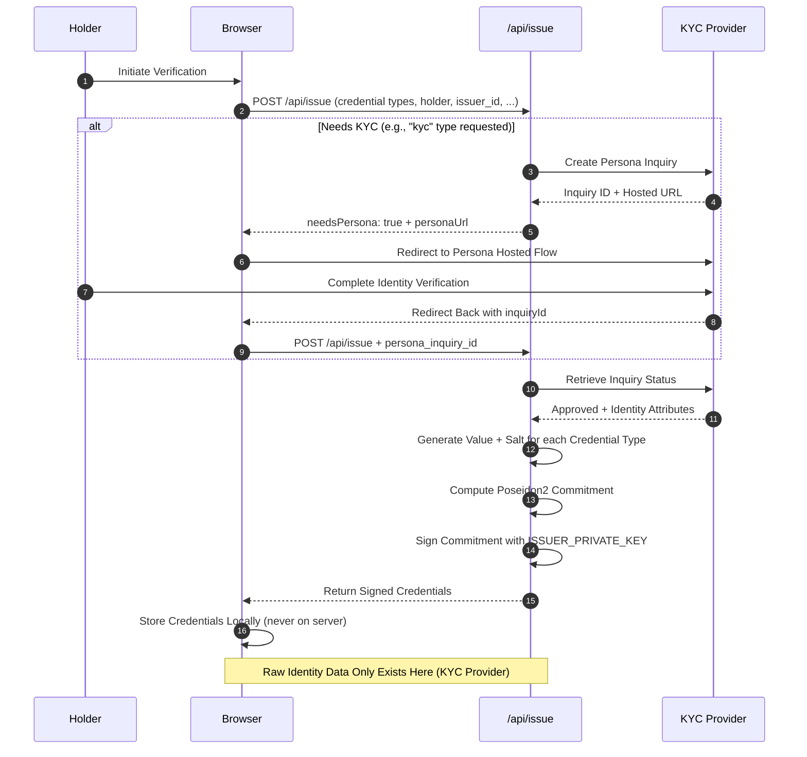
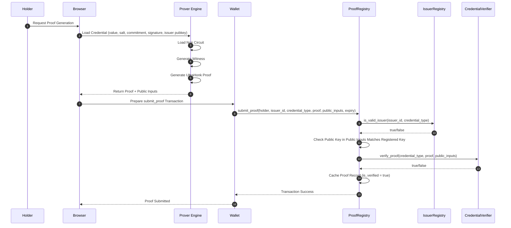
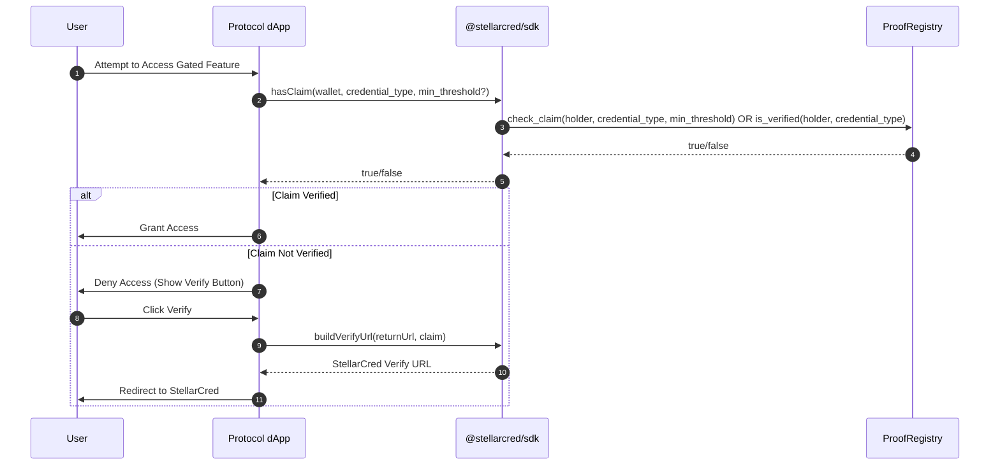

# StellarCred Architecture

This document describes the overall architecture of StellarCred, including trust boundaries and data flows.

## Trust Boundaries

StellarCred is designed with strict privacy guarantees:
- **Identity data never leaves the browser** except for direct interactions with KYC providers (e.g., Persona).
- No raw identity data is stored on-chain or in backend services.
- Only cryptographic commitments and zero-knowledge proofs are published on the Stellar blockchain.

## High-Level Component Diagram

The diagram below shows the key components and their interactions. It also highlights the trust boundaries.

```mermaid
graph TD
    subgraph Browser
        Prover[Prover Engine<br/>Noir + bb.js]
        Wallet[Connected Wallet<br/>Freighter/other]
    end
    subgraph Backend
        IssueEndpoint[/api/issue]
        KYCProvider[KYC Provider<br/>Persona/Plaid]
    end
    subgraph StellarSoroban["Stellar Soroban Contracts"]
        ProofRegistry[ProofRegistry]
        IssuerRegistry[IssuerRegistry]
        CredentialVerifier[CredentialVerifier]
    end
    subgraph ConsumingProtocols["Consuming Protocols"]
        ProtocolDapp[Protocol dApp]
    end
    
    Browser -->|1. Request Credential| IssueEndpoint
    IssueEndpoint -->|2. Verify Identity| KYCProvider
    KYCProvider -->|3. Verification Result| IssueEndpoint
    IssueEndpoint -->|4. Signed Credential| Browser
    Browser -->|5. Generate Proof Locally| Prover
    Prover -->|6. Proof + Public Inputs| Wallet
    Wallet -->|7. submit_proof| ProofRegistry
    ProofRegistry -->|8. is_valid_issuer| IssuerRegistry
    ProofRegistry -->|9. verify_proof| CredentialVerifier
    ProofRegistry -->|10. is_verified State| ProtocolDapp
```

## Credential Issuance Flow

This sequence diagram shows how a holder obtains a signed credential from the issuer.



**Privacy Note:** Raw identity attributes (like date of birth, country code) are only sent to and stored by the KYC provider. They are never stored by /api/issue or written to the blockchain.

## Proving and Verification Flow

This sequence diagram shows how a holder generates a zero-knowledge proof locally and submits it to the ProofRegistry contract.



## Consuming Protocols Flow

This sequence diagram shows how third-party protocols (dApps) consume verified credentials by checking the ProofRegistry.


