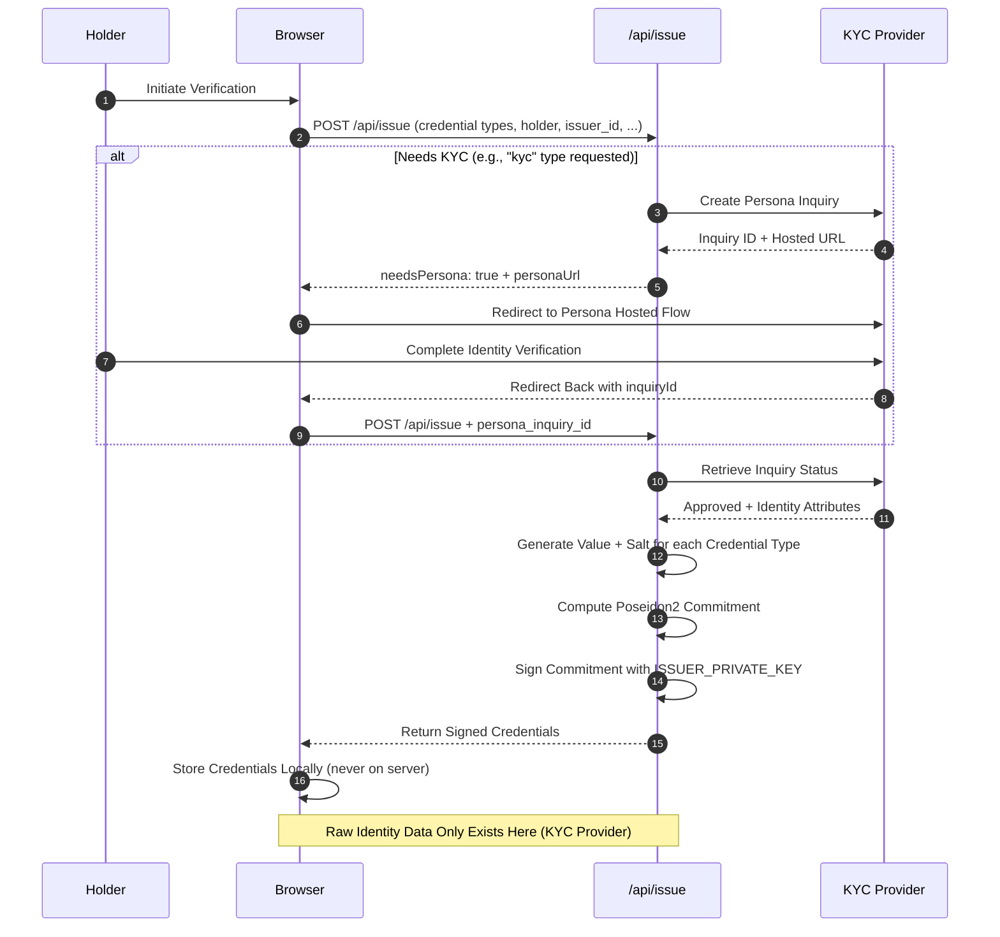
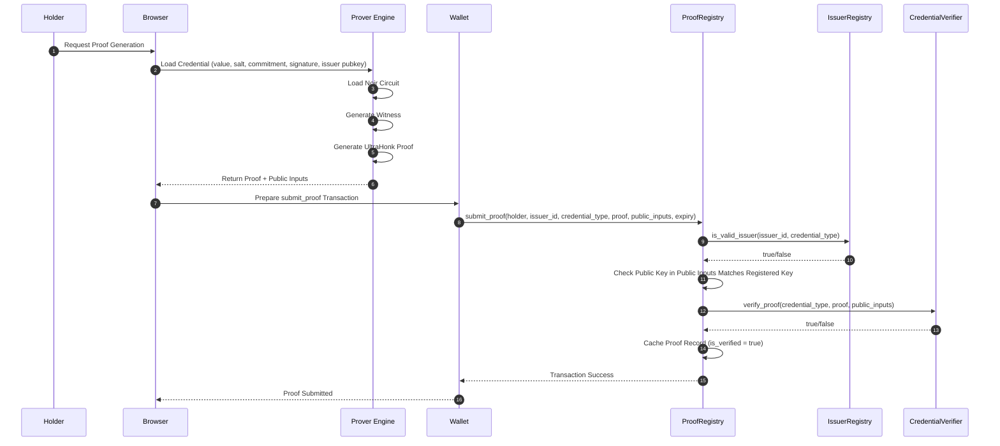
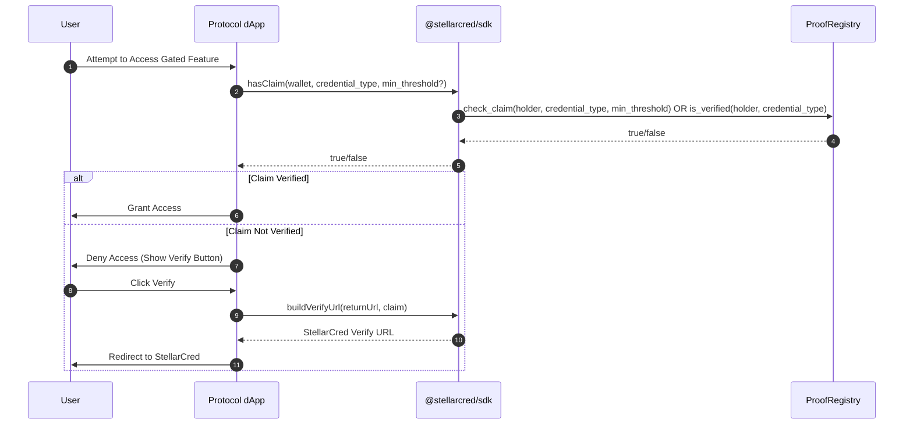

# StellarCred Architecture

This document describes the overall architecture of StellarCred, including trust boundaries and data flows.

## Trust Boundaries

StellarCred is designed with strict privacy guarantees:
- **Identity data never leaves the browser** except for direct interactions with KYC providers (e.g., Persona).
- No raw identity data is stored on-chain or in backend services.
- Only cryptographic commitments and zero-knowledge proofs are published on the Stellar blockchain.

## High-Level Component Diagram

The diagram below shows the key components and their interactions. It also highlights the trust boundaries.

```mermaid
graph TD
    subgraph Browser
        Prover[Prover Engine<br/>Noir + bb.js]
        Wallet[Connected Wallet<br/>Freighter/other]
    end
    subgraph Backend
        IssueEndpoint[/api/issue]
        KYCProvider[KYC Provider<br/>Persona/Plaid]
    end
    subgraph StellarSoroban["Stellar Soroban Contracts"]
        ProofRegistry[ProofRegistry]
        IssuerRegistry[IssuerRegistry]
        CredentialVerifier[CredentialVerifier]
    end
    subgraph ConsumingProtocols["Consuming Protocols"]
        ProtocolDapp[Protocol dApp]
    end
    
    Browser -->|1. Request Credential| IssueEndpoint
    IssueEndpoint -->|2. Verify Identity| KYCProvider
    KYCProvider -->|3. Verification Result| IssueEndpoint
    IssueEndpoint -->|4. Signed Credential| Browser
    Browser -->|5. Generate Proof Locally| Prover
    Prover -->|6. Proof + Public Inputs| Wallet
    Wallet -->|7. submit_proof| ProofRegistry
    ProofRegistry -->|8. is_valid_issuer| IssuerRegistry
    ProofRegistry -->|9. verify_proof| CredentialVerifier
    ProofRegistry -->|10. is_verified State| ProtocolDapp
```

## Credential Issuance Flow

This sequence diagram shows how a holder obtains a signed credential from the issuer.



**Privacy Note:** Raw identity attributes (like date of birth, country code) are only sent to and stored by the KYC provider. They are never stored by /api/issue or written to the blockchain.

### Batch Issuance API (`/api/issue/batch`)

For issuers onboarding cohorts of users at scale (e.g., educational accreditation, institutional verification), the `/api/issue/batch` endpoint accepts an array of issuance requests (up to 50 items per call).

- **Partial-failure semantics**: Each item is processed and signed independently. A validation error on one item (e.g. invalid type, missing address) returns a failure result for that specific index while all valid items succeed and are signed.
- **Security model**: Identical per-item security constraints (`prehash: false` ECDSA signature over raw Poseidon2 commitment, server-side issuer key only, zero raw PII persisted).
- **Idempotency & rate limiting**: Supports `Idempotency-Key` headers for safe retries and enforces per-IP and per-wallet rate limits.

### Commitment layout and the salt entropy requirement

Every credential type shares one commitment scheme:

`commitment = Poseidon2::hash([value, salt], 2)`

(employment uses a 3-arity variant, `Poseidon2::hash([status, seniority, salt], 3)`,
via the `commit3` helper - same requirement applies to its `salt`.)

`commitment` and the issuer's signature over it are the only credential data
that ever leaves the browser or issuer server. `value` and `salt` stay
private, known only to the holder and (at issuance time) the issuer.

**`salt` is what makes the commitment hiding, not `value`.** Several credential
types have small, guessable value domains - a date of birth spans a few tens
of thousands of plausible days, an ISO 3166-1 country code is one of about
250 values. Without a salt, `commitment` would be a deterministic hash of a
low-entropy input: an observer could recompute `Poseidon2::hash([candidate, 0], 2)`
for every candidate in the domain and match it against the public commitment,
recovering the credential's value with no cryptographic work at all. Salting
turns that into an infeasible search over the full BN254 scalar field
instead.

This requirement is enforced at two independent points:

1. **In-circuit floor.** Every credential circuit (`kyc_proof`, `age_proof`,
   `income_proof`, `jurisdiction_proof`, `funds_proof`, `accreditation_proof`,
   `employment_proof`, `range_proof`, `aggregate_proof`) and both commitment
   helpers (`commit`, `commit3`) assert `salt != 0` before using it. This is a
   cheap, unconditional check that blocks the degenerate zero-salt case. It
   is **not** sufficient on its own - a salt of `1` or `2` also satisfies
   `salt != 0` while remaining brute-forceable - so this is a floor, not the
   actual entropy guarantee.
2. **Issuer-side generation (the real guarantee).** `randomField()` in
   `frontend/packages/issuer/src/index.ts` is the sole source of salt (and of
   the KYC "secret" value) across the issuer. It draws 31 bytes (248 bits)
   from `crypto.randomBytes`, a CSPRNG. 31 bytes was chosen specifically so
   the result always falls below the BN254 scalar field modulus
   (`21888242871839275222246405745257275088548364400416034343698204186575808495617`,
   ~2^254) without needing modulo reduction - this avoids modulo bias
   entirely rather than requiring rejection sampling to correct for it.

Any future change to salt generation - a new issuer implementation, a
different SDK, a migration to a different language or runtime - **must**
preserve both properties: full-width CSPRNG output, and no modulo bias when
reducing into the field. The in-circuit `assert(salt != 0)` will not catch a
regression to a narrow or predictable range; only an audit of the generator
will.

## Proving and Verification Flow

This sequence diagram shows how a holder generates a zero-knowledge proof locally and submits it to the ProofRegistry contract.



### Client-side proving runs in a dedicated Web Worker

Witness generation and proof orchestration execute in a dedicated worker
(`frontend/lib/proof-worker.ts`), not on the UI thread. Even with multithreaded
bb.js, the surrounding work — decoding the witness response, constructing the
UltraHonk backend, driving `generateProof`, and serializing ~14.5 kB of proof
bytes — was enough to jank the progress UI mid-proof.

```
main thread (UI)                        prover worker
────────────────                        ─────────────
{ command: "prove", jobId, request } →  POST /api/witness + hex decode
                                        backend construction (cached per type)
← { event: "progress", stage }          UltraHonk proving via bb.js
← { event: "result", proof, … }         proof serialization (transferred)
{ command: "cancel", jobId }         →  aborts the witness fetch, destroys
                                        the backend, stopping the proof
```

- **Protocol** — `frontend/lib/proof-protocol.ts` is types-only, shared by both
  sides, so it can never create a runtime edge between the threads.
- **Progress** — the worker posts one message per stage (`witness` → `circuit`
  → `proof`), which is what keeps the holder page's progress bar and elapsed
  timer animating during the heaviest operation.
- **Cancellation** — an `AbortSignal` cannot cross a worker boundary, so
  `lib/proof-client.ts` translates an abort into a `cancel` command and rejects
  locally with the same `AbortError` the inline path throws. The worker aborts
  the in-flight witness fetch and destroys the WASM backend, which is what
  actually stops bb.js.
- **Cross-origin isolation** — a dedicated worker created by a
  `crossOriginIsolated` page is itself cross-origin isolated, so
  `SharedArrayBuffer` remains available inside it and bb.js keeps its
  multithreaded path. `lib/proof.ts` reads `globalThis.crossOriginIsolated`
  (not `window`) for exactly this reason, and the worker's `ready` message
  reports the values it observed so a broken COOP/COEP deployment is visible in
  the console rather than silently single-threading.
- **Fallback** — when Workers are unavailable (unit tests, a worker blocked by
  CSP, a worker script that fails to load) the same request runs inline on the
  main thread through the identical `lib/proof.ts` engine, so behaviour does not
  depend on which path was taken.
- **Why the worker is a file under `public/`** — `scripts/build-proof-worker.mjs`
  bundles the TypeScript source into `public/workers/proof-worker.js` on
  predev/prebuild, mirroring how `copy-bb.mjs` stages bb.js. Next's App Router
  runs every app-graph module through `next-flight-client-module-loader`, which
  empties a webpack worker chunk, so the worker is served as a plain native ES
  module instead. The TypeScript source stays the single source of truth.

## Consuming Protocols Flow

This sequence diagram shows how third-party protocols (dApps) consume verified credentials by checking the ProofRegistry.


